# Personalized Aurora Sweep's Keymap

_This keymap is based on [Aurora Sweep](https://github.com/qmk/qmk_firmware/tree/master/keyboards/splitkb/aurora/sweep/keymaps/default) default keyboard._

## What do all these layers do?

### Layer 0: QWERTY Base layer

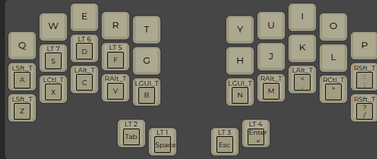

### Layer 1: Left Thumb; arrow navigation with special signs

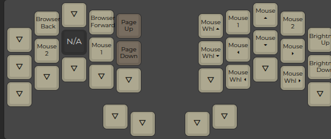

### Layer 2: Left thumb; function keys and stuff

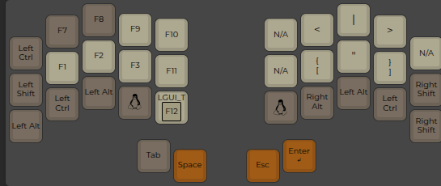

### Layer 3: Right Thumb; Numbers and stuff

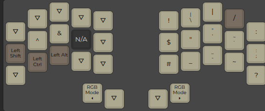

### Layer 4: Right Tumb; more stuff and switching to other base layers

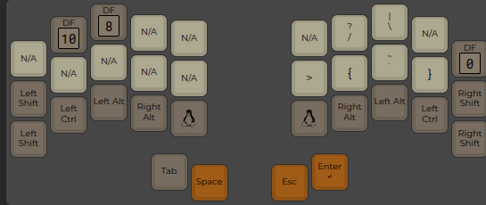

### Layer 5: Legacy keymap for old habits

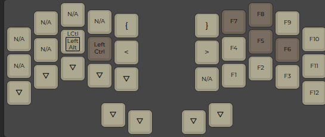

### Layer 6: Numbers

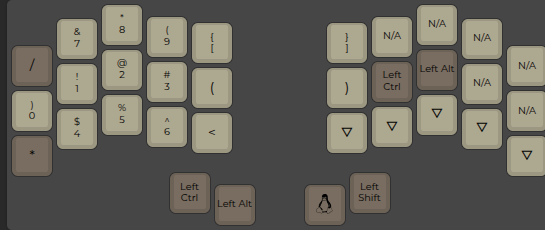

### Layer 8: Base Layer Colemak typing

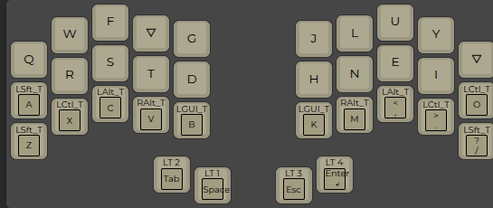

### Layer 10: Base Gaming Layer

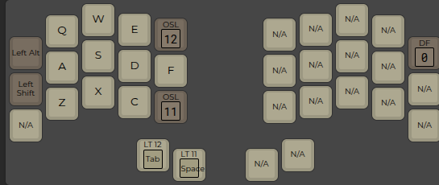

### Layer 11: Gaming layer; Numbers

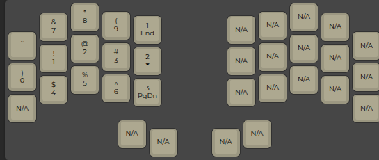

### Layer 12: Gaming layer; Function keys

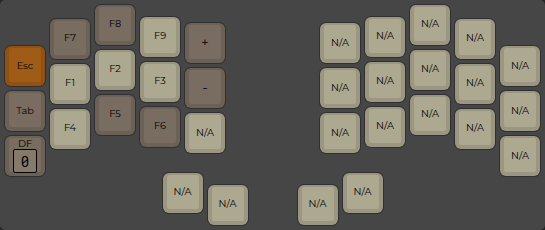

### How to customize it further?

I prefer to compile firmware and keyboard locally. To do so, you should:

1. Setup [QMK firmware](https://github.com/qmk/qmk_firmware)
2. Clone this repo into firmware `git clone https://github.com/lppl/aurora_sweep_keymap.git keyboards/splitkb/aurora/sweep/keymaps/lppl`
3. Build.

To customize this even more:

1. Customize keymap.json in [QMK Editor](https://config.qmk.fm/#/splitkb/aurora/sweep/rev1/LAYOUT_split_3x5_2)
2. Copy default folder and replace its keymap.json with new keymap.
3. Put your keyboard in boot mode and flash it `qmk flash -e CONVERT_TO=liatris -kb splitkb/aurora/sweep/rev1 -km lppl`. <- customize for your own controller
