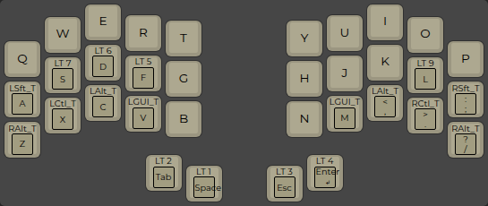
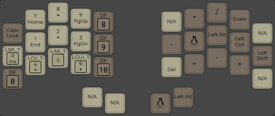
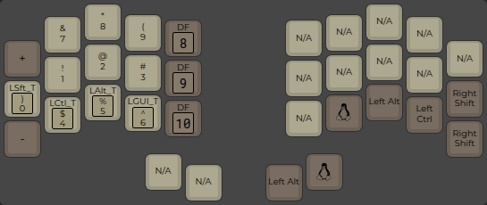
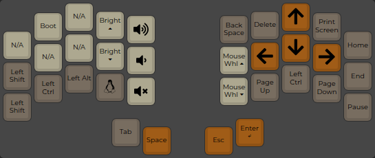
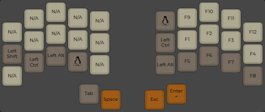
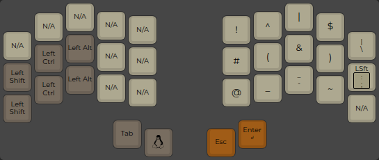
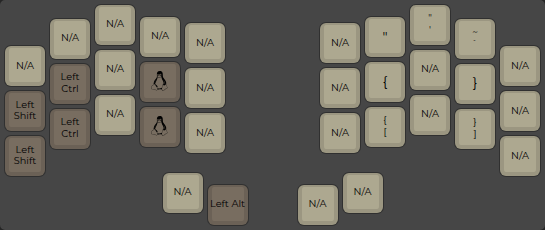
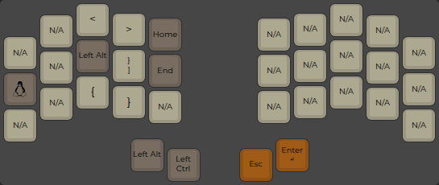

# Personalized Aurora Sweep's Keymap
_This keymap is based on [Aurora Sweep](https://github.com/qmk/qmk_firmware/tree/master/keyboards/splitkb/aurora/sweep/keymaps/default) default keyboard._

What do all these layers do?
----------------------------

### Layer 0: Base layer

### Layer 1: Mouse

### Layer 2: Navigation

### Layer 3: Right symbols

### Layer 4: Left symbols

### Layer 5: Function keys

### Layer 6: Numbers

### Layer 7: Always accessible

### How to customize it further?

I prefer to compile firmware and keyboard locally. To do so, you should:

1. Setup [QMK firmware](https://github.com/qmk/qmk_firmware)
2. Clone this repo into firmware `git clone https://github.com/lppl/aurora_sweep_keymap.git keyboards/splitkb/aurora/sweep/keymaps/lppl`
3. Build.
 
To customize this even more:
1. Customize keymap.json in [QMK Editor](https://config.qmk.fm/#/splitkb/aurora/sweep/rev1/LAYOUT_split_3x5_2)
2. Copy default folder and replace its keymap.json with new keymap.
3. Put your keyboard in boot mode and flash it `qmk flash -e CONVERT_TO=liatris -kb splitkb/aurora/sweep/rev1 -km lppl`. <- customize for your own controller
